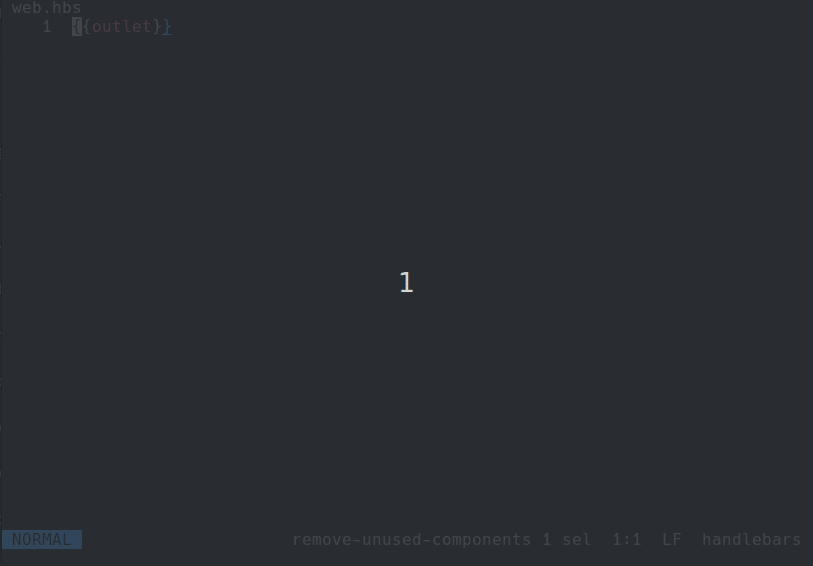

# helix-abbrevs-ls
Helix abbreviations Language Server

This package allows you to add abbreviations to the [Helix](https://helix-editor.com) editor
using a LSP server for autocompleting abbreviations.

You can define your abbreviations in a TOML file and use it in Helix.




## Install
```
npm i -g helix-abbrevs-ls
```


### Usage
Create an `abbrevs.toml` file inside your Helix config dir `~/.config/helix/abbrevs.toml`

Add abbreviations inside it like:

```toml
hx = "Helix"
lsp = "Language Server Protocol"
cfg = "config"
js = "JavaScript"
ts = "TypeScript"
```

### Config
Config your `languages.toml` to use this Language server

```toml
[[language]]
name = "handlebars"
roots = ["package.json"]
file-types = ["hbs"]
scope = "source.hbs"
language-server = { command = "helix-abbrevs-ls" } 
```

### Known limitations
- The language server can be only used for one language at a time
- The abbreviations unlike `Vim` are not autocompleted as soon as you press Space or an Escape character
